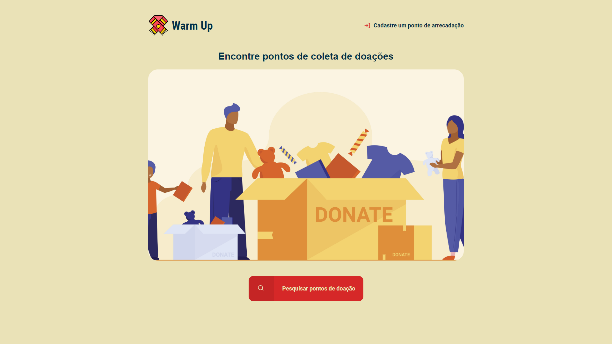

# Projeto Warm Up
 
 Aplicação **Warm Up**, desenvolvido com base na aplicação Ecoleta, para fixar o aprendizados da Next Level Week e explorar novas funcionalidades.
 
 ## A Aplicação
 
 O warmUp é uma aplicação que possibilita cadastrar e localizar pontos de doações.
 
:sparkling_heart::sparkling_heart::sparkling_heart:
 
## Screenshot
 
 
## :computer: Tecnologias
- HTML
- CSS
- SASS
- JavaScripyt
- Node.js
- SQL
- SQLlite

:rocket: :rocket: :rocket:
